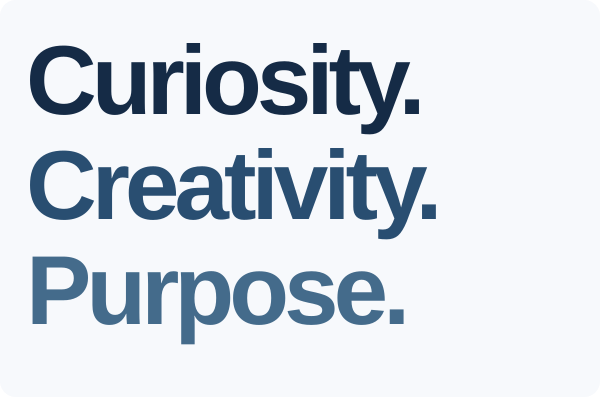
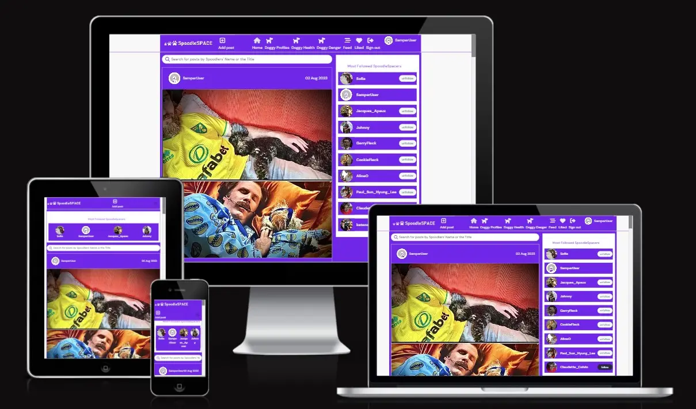
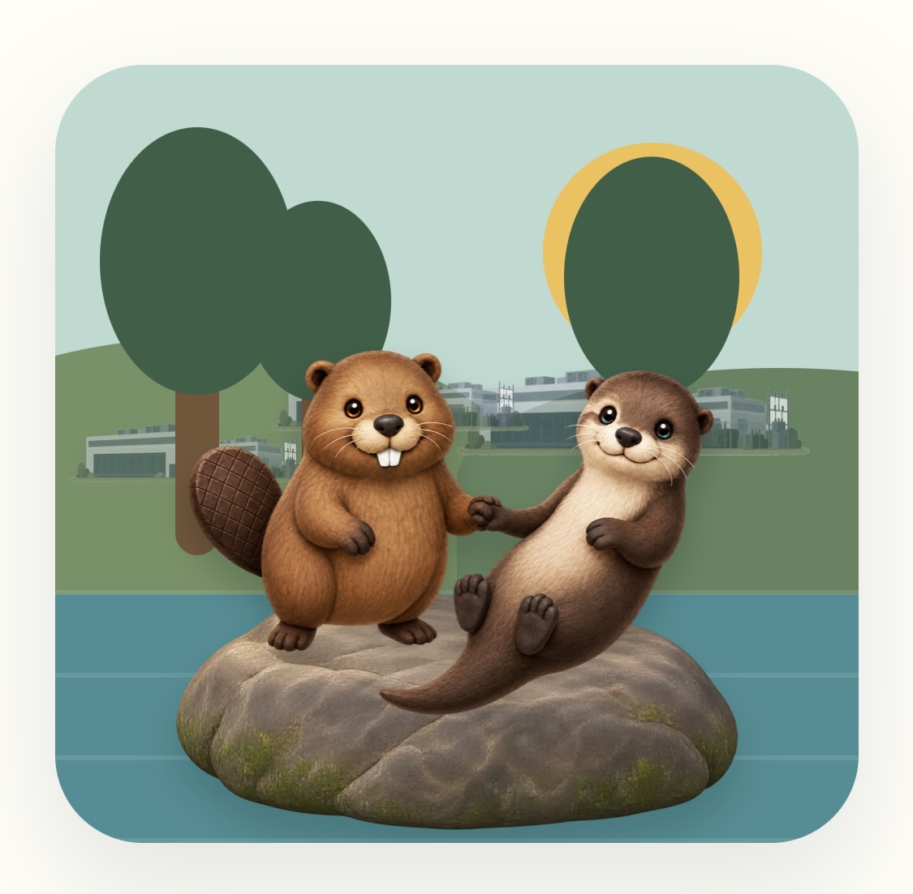
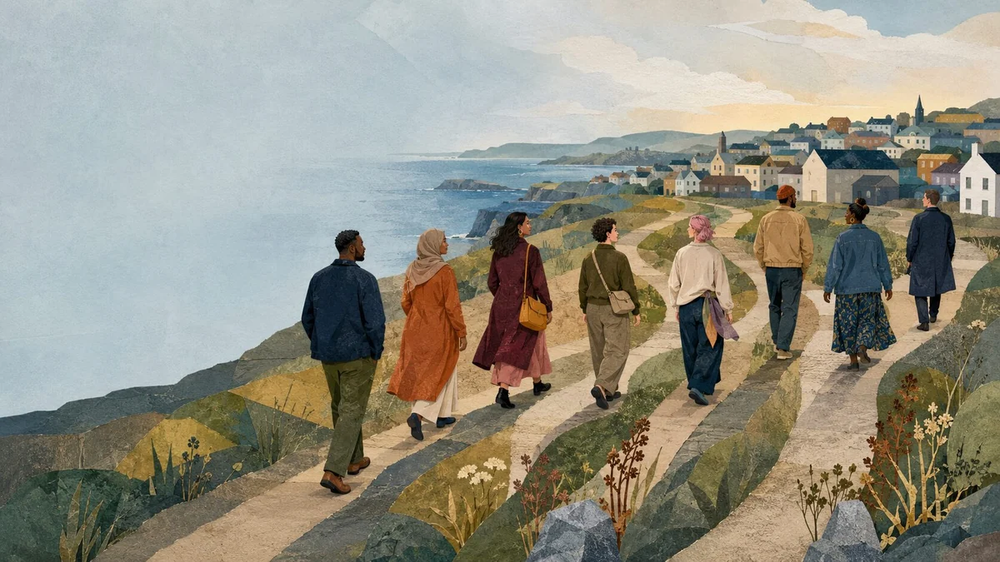
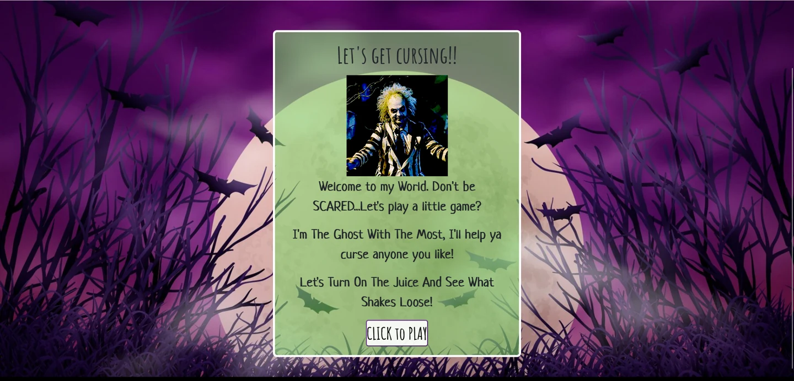
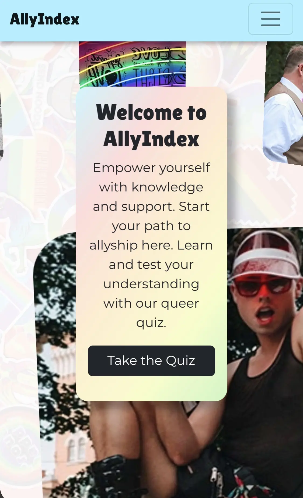

#  Sam Tim Solutions

[Home](#-sam-tim-solutions) &nbsp;·&nbsp; [Work](#explore-my-work) &nbsp;·&nbsp; [Experience](#work-in-context) &nbsp;·&nbsp; [Research](#a-foundation-in-evidence) &nbsp;·&nbsp; [Approach](#people-first-then-the-technology) &nbsp;·&nbsp; [Contact](#good-things-start-with-a-conversation)

  <picture>
    <source media="(prefers-color-scheme: dark)" srcset="assets/profile/portfolio-hero-dark.svg">
    
  </picture>
  

**Software and Community Developer based in Dublin, Ireland.**

Sam Tim Solutions makes information clearer, connects communities and builds useful digital experiences.

**[Explore my work](#explore-my-work)** &nbsp;·&nbsp; **[Let’s talk](#good-things-start-with-a-conversation)** &nbsp;·&nbsp; [Visit my portfolio](https://samobrienolinger.github.io/SamOBrienOlinger/)

---

SELECTED WORK

## Explore my work

Community resources, playful learning and applications built around real interests. Choose a project to see its preview, website and source code.

<strong>S&amp;CT</strong> — Community connection

Helping neighbours find local information, practical supports and ways to connect. A shared resource for a welcoming, informed community.

`HTML` `CSS` `JavaScript`

**[Explore S&CT](https://samobrienolinger.github.io/saggart-and-citywest-together/)** &nbsp;·&nbsp; [Source code](https://github.com/SamOBrienOlinger/saggart-and-citywest-together)

<strong>SpoodleSpace</strong> — Full-stack application

A dog-community application combining a React interface with a Django REST API, profiles, posts, comments, likes and following.

`React` `Python` `Django REST Framework`

**[Design preview](https://samobrienolinger.github.io/spoodle-space-pp5/)** &nbsp;·&nbsp; [Source code](https://github.com/SamOBrienOlinger/spoodle-space-pp5) &nbsp;·&nbsp; [Backend API](https://github.com/SamOBrienOlinger/drf-spoodle-space)

The public preview shows the interface; account and API features require the configured backend.

<strong>Beaver v Otter</strong> — Playful learning

Ten data centres. Two animals. One river. An interactive game exploring how everyday choices change the water.

`JavaScript` `HTML` `CSS`

**[Play Beaver v Otter](https://samobrienolinger.github.io/beaver-v-otter/)** &nbsp;·&nbsp; [Source code](https://github.com/SamOBrienOlinger/beaver-v-otter)

<strong>A New Life in Ireland</strong> — Interactive learning

Every journey to Ireland is different. Follow one of twelve fictional people through choices, circumstances and life in Ireland.

`React` `TypeScript` `Vite`

**[Explore the journeys](https://samobrienolinger.github.io/My-New-Life-in-Ireland/)** &nbsp;·&nbsp; [Source code](https://github.com/SamOBrienOlinger/My-New-Life-in-Ireland)

<strong>Stopped: Both Sides</strong> — Interactive learning

A choice-based learning game exploring rights, responsibilities and fair decision-making in Ireland from public and Garda perspectives.

`JavaScript modules` `HTML` `CSS`

**[Explore Both Sides](https://samobrienolinger.github.io/stopped-both-sides/)** &nbsp;·&nbsp; [Source code](https://github.com/SamOBrienOlinger/stopped-both-sides)

<strong>Beetlejuice</strong> — Playful experiences

A playful browser experience inspired by the world of Beetlejuice.

**[Explore Beetlejuice](https://samobrienolinger.github.io/Beetlejuice-Beetlejuice-Beetlejuice/)** &nbsp;·&nbsp; [Source code](https://github.com/SamOBrienOlinger/Beetlejuice-Beetlejuice-Beetlejuice)

<strong>Know Yellowknife</strong> — Place-based learning

Explore Yellowknife through local information and a replayable knowledge quiz.

**[Explore Yellowknife](https://samobrienolinger.github.io/know-yellowknife/)** &nbsp;·&nbsp; [Source code](https://github.com/SamOBrienOlinger/know-yellowknife)

<strong>AllyIndex</strong> — Team project

A team-built introduction to LGBTQIA+ history, terminology and allyship, combining learning resources with an interactive quiz.

**[Explore AllyIndex](https://declan444.github.io/24-7-hackathon-team9/)** &nbsp;·&nbsp; [Source code](https://github.com/declan444/24-7-hackathon-team9) &nbsp;·&nbsp; [My fork](https://github.com/SamOBrienOlinger/24-7-hackathon-team9)

<strong>The White Whale vs Old Thunder</strong> — Literary game

Choose Moby Dick or Ahab in a literary coordinate-hunt game with two playable perspectives.

**[Begin the hunt](https://samobrienolinger.github.io/the-white-whale-vs-old-thunder/)** &nbsp;·&nbsp; [Source code](https://github.com/SamOBrienOlinger/the-white-whale-vs-old-thunder)

[Browse the interactive portfolio](https://samobrienolinger.github.io/SamOBrienOlinger/#work)

---

EXPERIENCE

## Work in context

Software, public service and social research. Different settings, with people at the centre.

**Public service · Executive Officer** 
Junior Software Developer at the Department of Social Protection.

**Strategy & collaboration · Strategic Development & Innovation** 
People-first projects and collaboration.

**Research, policy & community development** 
Education, policing, inclusion and social policy.

---

RESEARCH & WRITING

## A foundation in evidence

Research helps me understand the people and contexts behind the software.

- **[Police, Race and Culture in the ‘New Ireland’](https://link.springer.com/book/10.1057/9781137490452)** — book, Palgrave Macmillan.
- **[Routledge International Handbook of Police Ethnography](https://www.routledge.com/Routledge-International-Handbook-of-Police-Ethnography/Fleming-Charman/p/book/9780367539399)** — contributing author, Chapter 34.

[Explore research & writing](https://samobrienolinger.github.io/SamOBrienOlinger/#research) &nbsp;·&nbsp; [More background](docs/research-and-background.md)

---

ABOUT & APPROACH

## People first. Then the technology.

I’m Sam O’Brien-Olinger, a full-stack developer and social researcher. I’m interested in what happens when technical skills meet a good understanding of people.

My background spans sociology, public policy, education and community development. It shapes how I build: listen carefully, understand the context and make the next step clear.

**Understand** — find the real problem. 
**Simplify** — translate knowledge for all. 
**Build** — make it useful.

I work across frontend and backend systems, with accessibility, maintainability and clear communication built into the process.

**Tools I work with**

`JavaScript` `TypeScript` `React` `Python` `Django` `REST APIs` `SQL` `PostgreSQL` `HTML & CSS` `Git`

**PhD in Sociology** — University College Dublin. 
**Diploma in Full Stack Software Development** — Code Institute · Advanced Front End. [View credential](https://www.credential.net/profile/samobrienolinger167622/wallet)

---

LET’S MAKE SOMETHING USEFUL

## Good things start with a conversation

Have a digital project, a research question or a community idea? I’d be glad to hear about it.

**[Send me an email](mailto:samobrienolinger@gmail.com)** &nbsp;·&nbsp; **[LinkedIn](https://www.linkedin.com/in/sam-o-brien-olinger-b658283a/)** &nbsp;·&nbsp; [Visit Sam Tim Solutions](https://samobrienolinger.github.io/SamOBrienOlinger/)

© 2026 Sam O’Brien-Olinger · Sam Tim Solutions · [Repository setup & credits](docs/repository-guide.md) · [Back to top](#-sam-tim-solutions)
