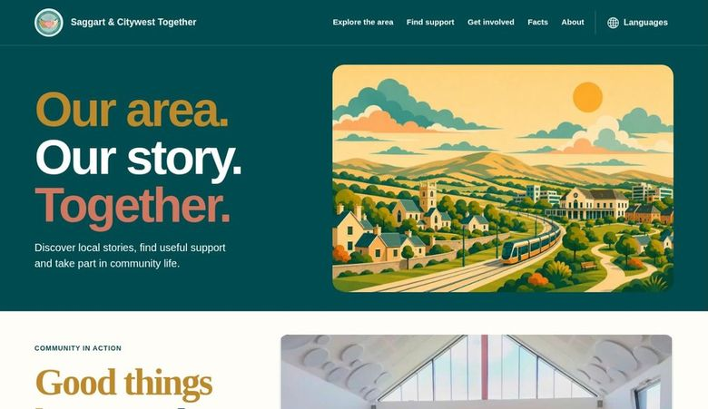
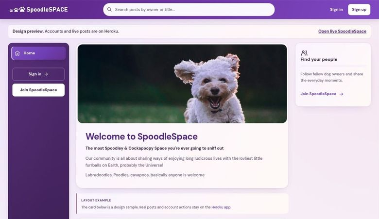
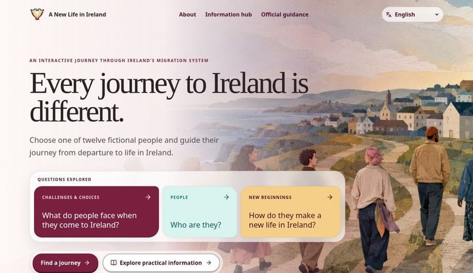
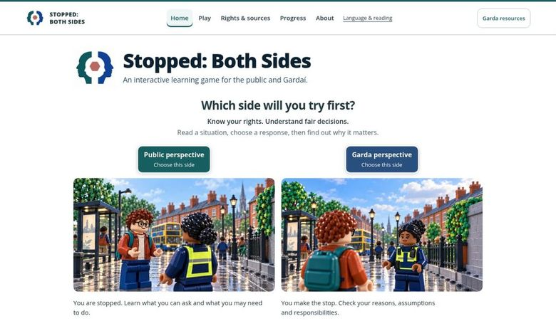

<picture>
  <source media="(max-width: 600px)" srcset="assets/profile/banner-mobile.svg">
  
</picture>

# Sam O'Brien-Olinger

**Full stack software developer · Dublin, Ireland**

I build web applications and interactive learning experiences that make information easier to use. I'm a **Junior Software Developer at the Department of Social Protection**. My independent projects bring together software, social research and community work.

**[View my portfolio](https://samobrienolinger.github.io/SamOBrienOlinger/)** &nbsp;·&nbsp; **[LinkedIn](https://www.linkedin.com/in/sam-o-brien-olinger-b658283a/)** &nbsp;·&nbsp; **[Email me](mailto:samobrienolinger@gmail.com)**

`JavaScript` `TypeScript` `React` `Python` `Django` `PostgreSQL`

## Selected work

  
  
  
  

### Saggart & Citywest Together

A neighbourhood website connecting local information, practical supports, history and community life. Includes a Facts section, a source directory, translation controls and an integrated history gallery.

**HTML · CSS · JavaScript** &nbsp;·&nbsp; [Visit website](https://samobrienolinger.github.io/saggart-and-citywest-together/) &nbsp;·&nbsp; [View code](https://github.com/SamOBrienOlinger/saggart-and-citywest-together)

### SpoodleSpace

A dog-community application with a React frontend and Django REST API. The code covers profiles, posts, comments, likes and following, with API permissions and media handling.

**React · Python · Django REST Framework** &nbsp;·&nbsp; [Frontend](https://github.com/SamOBrienOlinger/spoodle-space-pp5) &nbsp;·&nbsp; [Backend](https://github.com/SamOBrienOlinger/drf-spoodle-space) &nbsp;·&nbsp; [Design preview](https://samobrienolinger.github.io/spoodle-space-pp5/)

The public preview demonstrates the interface; account and API features require the configured backend.

### A New Life in Ireland

An interactive learning experience following twelve fictional journeys to Ireland. Combines character choices, feedback, multilingual content and links to official information.

**React · TypeScript · Vite** &nbsp;·&nbsp; [Explore the experience](https://samobrienolinger.github.io/My-New-Life-in-Ireland/) &nbsp;·&nbsp; [View code](https://github.com/SamOBrienOlinger/My-New-Life-in-Ireland)

### Stopped: Both Sides

A learning game exploring the same Garda encounter from two perspectives. Branching decisions, persistent characters and saved progress let players switch sides and compare the explanations.

**JavaScript modules · HTML · CSS** &nbsp;·&nbsp; [Try the game](https://samobrienolinger.github.io/stopped-both-sides/) &nbsp;·&nbsp; [View code](https://github.com/SamOBrienOlinger/stopped-both-sides)

A New Life in Ireland and Stopped: Both Sides are independent educational projects.

<strong>More projects and team work</strong>

- **[Beaver v Otter](https://samobrienolinger.github.io/beaver-v-otter/)** — an interactive game about a river, data centres and environmental choices. [Code](https://github.com/SamOBrienOlinger/beaver-v-otter)
- **[The White Whale versus Old Thunder](https://samobrienolinger.github.io/the-white-whale-vs-old-thunder/)** — a literary coordinate-hunt game with two playable perspectives. [Code](https://github.com/SamOBrienOlinger/the-white-whale-vs-old-thunder)
- **[Punch Lion](https://samobrienolinger.github.io/punch-lion/)** — a website for comedy, workshops and live experiences. [Code](https://github.com/SamOBrienOlinger/punch-lion)
- **[Know Yellowknife](https://samobrienolinger.github.io/know-yellowknife/)** — local learning and a replayable knowledge quiz. [Code](https://github.com/SamOBrienOlinger/know-yellowknife)
- **[Know Dublin](https://samobrienolinger.github.io/dublin-city-bridges-frontend/)** — learning about Dublin's bridges, history and civic life. [Code](https://github.com/SamOBrienOlinger/dublin-city-bridges-frontend)
- **[AllyIndex](https://declan444.github.io/24-7-hackathon-team9/)** — a team-built introduction to LGBTQIA+ history, terminology and allyship. [Team repository](https://github.com/declan444/24-7-hackathon-team9) · [My fork](https://github.com/SamOBrienOlinger/24-7-hackathon-team9)
- **[Job Me](https://github.com/SamOBrienOlinger/elevate_hackathon_2024-get-a-gig)** — a collaborative Code Institute hackathon project focused on career readiness.

Earlier learning projects include [Cockapoo Club](https://github.com/SamOBrienOlinger/Cockapoo-Club-PortProj4), a Django booking application, and [Ships That Battle](https://github.com/SamOBrienOlinger/Ships-that-Battle), a Python terminal game. Team projects retain their contributor and media credits.

## How I work

- **Frontend:** semantic HTML, CSS, JavaScript, TypeScript and React, with attention to responsive layouts, keyboard access and clear feedback.
- **Backend and data:** Python, Django, Django REST Framework, SQL and PostgreSQL.
- **Delivery:** Git, GitHub, code review, iterative testing and collaboration.
- **Problem solving:** research, plain English and an understanding of the people using a service.

## Background & qualifications

**Diploma in Full Stack Software Development — Advanced Front End**, Code Institute. [View credential](https://www.credential.net/profile/samobrienolinger167622/wallet)

**PhD in Sociology**, University College Dublin. My experience in public service, research and community development informs how I approach software: understand the problem, make the information clear, and build something useful.

I'm the author of [*Police, Race and Culture in the 'New Ireland'*](https://link.springer.com/book/10.1057/9781137490452) and a contributor to the [*Routledge International Handbook of Police Ethnography*](https://www.routledge.com/Routledge-International-Handbook-of-Police-Ethnography/Fleming-Charman/p/book/9780367539399). [More research and background](docs/research-and-background.md)

---

**Have a project in mind?** [Email me](mailto:samobrienolinger@gmail.com) or [connect on LinkedIn](https://www.linkedin.com/in/sam-o-brien-olinger-b658283a/).

[Repository setup & credits](docs/repository-guide.md) · [Back to top](#sam-obrien-olinger)
