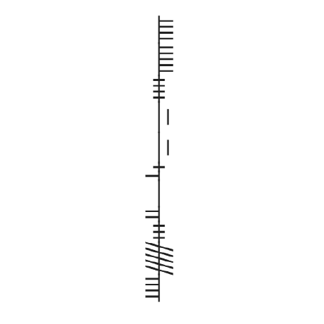

#  Sam Tim Solutions

**Sam O’Brien-Olinger · Software & community developer · Dublin, Ireland**

<picture>
  <source media="(max-width: 680px)" srcset="assets/profile/ui/hero-mobile.svg">
  
</picture>

I make information clearer, connect communities and build useful digital experiences.

  
  

  
  

[Work](#work) · [Experience](#experience) · [Research](#research) · [Approach](#approach) · [Contact](#contact)

<h2><picture><source media="(max-width: 680px)" srcset="assets/profile/ux/work-mobile.svg"></picture></h2>

Community resources, full-stack applications and playful learning. Open a site to try it, or view the code to see how it is built.

### Saggart & Citywest Together

**Community connection** · HTML, CSS, JavaScript

Local supports, facts, history and ways to connect. Includes a source directory, translation controls and an integrated history gallery.

  
  

### SpoodleSpace

**Full-stack application** · React, Python, Django REST Framework

A dog-community application with profiles, posts, comments, likes and following, built with a React frontend and a Django REST API.

  
  

The preview shows the interface; sign-in and account features require the configured backend. [View the backend API code](https://github.com/SamOBrienOlinger/drf-spoodle-space).

### Beaver v Otter

**Playful learning** · JavaScript, HTML, CSS

Ten data centres. Two animals. One river. A choice-based game exploring the dynamics between energy consumption and everyday decisions that change our waterways and natural environments.

  
  

### More to explore

#### A New Life in Ireland

**Interactive learning** · React, TypeScript, Vite 
Every journey to Ireland is different. Follow one of twelve fictional people through choices, circumstances and life in Ireland.

  
  

#### Stopped: Both Sides

**Interactive learning** · JavaScript modules, HTML, CSS 
Explore rights, responsibilities and fair decision-making in Ireland through public and Garda perspectives.

  
  

#### Beetlejuice

**Playful experience** 
A browser experience inspired by the world of Beetlejuice.

  
  

#### Know Yellowknife

**Place-based learning** 
Explore Yellowknife through local information and a replayable knowledge quiz.

  
  

#### AllyIndex

**Team project** 
Learning resources and a quiz introducing LGBTQIA+ history, terminology and allyship.

  
  

[My fork](https://github.com/SamOBrienOlinger/24-7-hackathon-team9)

#### The White Whale vs Old Thunder

**Literary game** 
Choose Moby Dick or Ahab in a coordinate-hunt game with two playable perspectives.

  
  

[Browse the full interactive portfolio](https://samobrienolinger.github.io/SamOBrienOlinger/#work)

<h2><picture><source media="(max-width: 680px)" srcset="assets/profile/ux/experience-mobile.svg"></picture></h2>

**Junior Software Developer · Department of Social Protection** 
Executive Officer, bringing software development together with a background in public service, research and community work.

**JavaScript · TypeScript · React · Python · Django · REST APIs · SQL · PostgreSQL · HTML & CSS · Git**

<h2><picture><source media="(max-width: 680px)" srcset="assets/profile/ux/research-mobile.svg"></picture></h2>

**PhD in Sociology, University College Dublin.** Research shapes how I understand people, test assumptions and design for context.

[Police, Race and Culture in the ‘New Ireland’](https://link.springer.com/book/10.1057/9781137490452) · Author, Palgrave Macmillan 
[Routledge International Handbook of Police Ethnography](https://www.routledge.com/Routledge-International-Handbook-of-Police-Ethnography/Fleming-Charman/p/book/9780367539399) · Contributing author, Chapter 34

[Research & background](docs/research-and-background.md)

<h2><picture><source media="(max-width: 680px)" srcset="assets/profile/ux/approach-mobile.svg"></picture></h2>

**Understand the people. Simplify the information. Build something useful.**

My background spans sociology, public policy, education and community development. I bring that perspective to frontend and backend work, with attention to accessibility, maintainability and clear communication.

Diploma in Full Stack Software Development · Code Institute, Advanced Front End · [View credential](https://www.credential.net/profile/samobrienolinger167622/wallet)

<h2><picture><source media="(max-width: 680px)" srcset="assets/profile/ux/contact-mobile.svg"></picture></h2>

Have a digital project, a research question or a community idea? I’d be glad to hear about it.

  

  
  

[Portfolio](https://samobrienolinger.github.io/SamOBrienOlinger/) · [Back to work](#work)

© 2026 Sam O’Brien-Olinger · Sam Tim Solutions · [Setup & credits](docs/repository-guide.md) · [Profile maintenance](docs/profile-layout.md)
